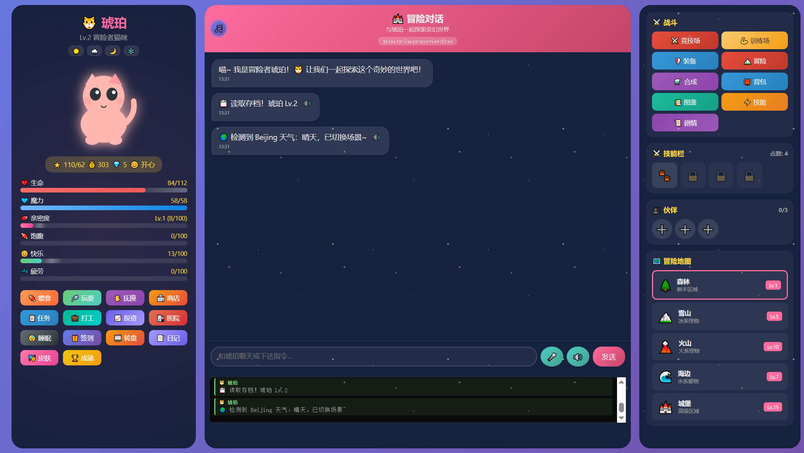

<div align="center">

# 🐱 琥珀猫冒险

**一个可爱的猫咪养成冒险游戏**

支持 AI 对话 · 语音识别 · 战斗系统 · 探索冒险

[功能特性](#-功能特性) · [快速开始](#-快速开始) · [配置说明](#-配置说明) · [API文档](#-api-端点)

</div>

---

## 📸 游戏截图

<div align="center">



</div>

---

## 🎮 功能特性

| 功能 | 说明 |
|------|------|
| 🤖 **AI 对话** | 支持 MiniMax、OpenRouter、Ollama 多种 AI 提供商 |
| 🎤 **语音识别** | 百度语音识别，支持多种音频格式 |
| 🔊 **语音合成** | Edge TTS / 浏览器原生 TTS |
| ⚔️ **战斗系统** | 回合制战斗，技能系统，伙伴系统 |
| 🗺️ **探索冒险** | 多地图探索，随机事件，NPC 互动 |
| 📈 **养成系统** | 等级、装备、皮肤、成就 |
| 🏆 **竞技场** | PVP 对战，排名系统 |

---

## 🚀 快速开始

### Windows 用户

```batch
# 首次安装
install.bat

# 启动服务
start.bat

# 停止服务
stop.bat

# 查看状态
status.bat
```

### Linux 服务器部署

```bash
# 首次安装
chmod +x install.sh
sudo ./install.sh

# 启动服务（默认守护进程模式）
./start.sh

# 前台运行（调试用）
./start.sh --foreground

# 停止服务
./stop.sh

# 强制停止
./stop.sh --force

# 查看状态和日志
./status.sh
```

### 远程部署

```batch
# Windows 连接远程服务器
connect.bat

# Windows 部署到远程服务器
deploy.bat
```

### 访问游戏

- **本地访问**: http://localhost
- **局域网访问**: http://你的IP
- **HTTPS访问**: https://你的IP（需配置SSL证书）

---

## 📁 文件说明

```
hupo-game/
├── 📄 index.html          # 游戏主程序
├── ⚙️ config.json         # 配置文件
├── 🐍 nanobot_bridge.py   # AI 桥接服务 + Web 服务器
├── 📦 voice-proxy.js      # 语音代理服务
│
├── 🪟 Windows 脚本
│   ├── start.bat          # 启动服务
│   ├── stop.bat           # 停止服务
│   ├── status.bat         # 查看状态
│   ├── install.bat        # 安装依赖
│   ├── connect.bat        # 连接远程服务器
│   └── deploy.bat         # 部署到远程服务器
│
├── 🐧 Linux 脚本
│   ├── start.sh           # 启动服务（守护进程）
│   ├── stop.sh            # 停止服务
│   ├── status.sh          # 查看状态和日志
│   └── install.sh         # 安装依赖和配置服务
│
├── 🔐 SSL 证书
│   ├── cert.pem           # SSL 证书
│   └── key.pem            # SSL 私钥
│
├── ⚙️ 服务配置
│   ├── hupo-bridge.service   # Systemd 服务配置
│   ├── hupo-voice.service    # 语音服务配置
│   └── logrotate.conf        # 日志轮转配置
│
└── 📂 logs/               # 日志目录（自动创建）
    ├── bridge_*.log       # AI 服务日志
    └── voice_*.log        # 语音服务日志

├── 📸 screenshots/        # 游戏截图
    └── game.png           # 游戏主界面
```

---

## 💻 环境要求

| 依赖 | 版本 | 用途 |
|------|------|------|
| Python | 3.8+ | AI 桥接服务 |
| Node.js | 14+ | 语音代理服务 |
| ffmpeg | 任意 | 音频格式转换（语音识别必需） |
| psutil | 最新 | 系统监控（自动安装） |

---

## ⚙️ 配置说明

编辑 `config.json` 配置各项服务：

```json
{
    "runtime_mode": "server",
    "server": {
        "host": "localhost",
        "http_port": 80,
        "https_port": 443,
        "voice_port": 85,
        "ssl_cert_file": "cert.pem",
        "ssl_key_file": "key.pem"
    },
    "local": {
        "type": "ollama",
        "ollama": {
            "host": "http://127.0.0.1:11434",
            "model": "gemma3:270m"
        }
    },
    "access_token": "your_token_here",
    "token_required": "yes/no",
    "minimax": {
        "api_key": "你的MiniMax API Key",
        "group_id": "你的Group ID",
        "model": "MiniMax-M2.7"
    },
    "openrouter": {
        "api_key": "你的OpenRouter API Key",
        "model": "arcee-ai/trinity-large-preview:free",
        "api_base": null
    },
    "ollama": {
        "api_key": "EMPTY",
        "model": "gemma3:270m",
        "api_base": "http://localhost:11434/v1"
    },
    "baidu": {
        "api_key": "你的百度API Key",
        "secret_key": "你的百度Secret Key"
    },
    "voice": {
        "provider": "baidu"
    },
    "active_provider": "minimax"
}
```

### Token 认证

| 参数 | 值 | 说明 |
|------|-----|------|
| `token_required` | `"yes"` | 启用 Token 认证，保护 API |
| `token_required` | `"no"` | 关闭 Token 认证（默认） |

启用 Token 认证后，访问方式：
- URL 参数: `?token=your_secure_token`
- Cookie: `hupo_token=your_secure_token`
- Authorization 头: `Bearer your_secure_token`

### 支持的 AI 提供商

| 提供商 | 说明 | 默认模型 |
|--------|------|----------|
| minimax | MiniMax AI（推荐） | MiniMax-M2.7 |
| openrouter | OpenRouter API | arcee-ai/trinity-large-preview:free |
| ollama | 本地 Ollama | gemma3:270m |

#### OpenRouter 配置指南

1. **注册账号**: 访问 [OpenRouter](https://openrouter.ai/) 注册账号
2. **获取 API Key**: 登录后进入 [Keys](https://openrouter.ai/keys) 页面创建 API Key
3. **免费模型**: OpenRouter 提供多个免费模型，推荐：
   - `arcee-ai/trinity-large-preview:free` - Trinity（推荐）
   - `google/gemini-2.0-flash-exp:free` - Google Gemini
   - `meta-llama/llama-3.3-8b-instruct:free` - Meta Llama
   - `deepseek/deepseek-r1:free` - DeepSeek R1
   - `qwen/qwen-2.5-72b-instruct:free` - 通义千问
4. **查看模型**: 访问 [Models](https://openrouter.ai/models) 查看所有可用模型

#### 百度语音配置指南

1. **注册账号**: 访问 [百度智能云](https://cloud.baidu.com/) 注册账号
2. **创建应用**: 进入 [语音技术](https://console.bce.baidu.com/ai/#/ai/speech/overview/index) 创建应用
3. **获取密钥**: 在应用详情页获取 `API Key` 和 `Secret Key`
4. **免费额度**: 百度语音提供免费调用额度，足够个人使用

### 支持的语音提供商

| 提供商 | 说明 | 要求 |
|--------|------|------|
| baidu | 百度语音识别（推荐） | 需要配置 API Key |
| browser | 浏览器原生语音识别 | ⚠️ 需要客户端能访问 Google 服务 |

> ⚠️ **注意**: 浏览器原生语音识别依赖 Google Web Speech API，客户端需要能够访问 Google 服务器。在中国大陆可能无法正常使用，建议使用百度语音识别。

---

## 🔌 API 端点

### 主服务 (端口 80/443)

| 端点 | 方法 | 认证 | 说明 |
|------|------|------|------|
| `/health` | GET | ❌ | 健康检查（仅本地访问） |
| `/metrics` | GET | ❌ | Prometheus 监控指标（仅本地） |
| `/model` | GET | ❌ | 获取当前模型信息（仅本地） |
| `/chat` | POST | ✅ | AI 对话接口 |
| `/tts` | POST | ✅ | 语音合成接口 |
| `/asr` | POST | ✅ | 语音识别接口 |
| `/*` | GET | ✅ | 静态文件服务 |

### 语音服务 (端口 85)

| 端点 | 方法 | 认证 | 说明 |
|------|------|------|------|
| `/voice/config` | GET | ✅ | 获取语音配置 |
| `/voice/token` | GET | ✅ | 获取百度语音 Token |
| `/voice/recognize` | POST | ✅ | 语音识别接口 |

### 健康检查示例

```bash
curl http://localhost/health
```

响应：
```json
{
    "status": "ok",
    "uptime": 3600.5,
    "cpu_percent": 15.2,
    "memory_percent": 42.8,
    "disk_percent": 55.0
}
```

---

## 🛡️ 安全特性

| 特性 | 说明 |
|------|------|
| 🔑 **Token 认证** | 所有 API 端点支持 Token 验证 |
| 🚦 **频率限制** | 防止单IP滥用（默认100次/分钟） |
| 📦 **请求限制** | 最大 10MB，防止内存耗尽攻击 |
| 🔒 **本地保护** | `/health`、`/metrics`、`/model` 仅允许本地访问 |
| ✅ **格式验证** | 音频格式白名单，防止文件注入 |

---

## 📊 监控特性

| 特性 | 说明 |
|------|------|
| 💓 **健康检查** | CPU/内存/磁盘监控 |
| 📈 **Prometheus** | 标准指标导出，支持 Grafana 可视化 |
| 🔄 **Systemd** | 开机自启，崩溃自动重启 |
| 📝 **日志轮转** | 按日期自动轮转，防止日志过大 |

### Prometheus 指标

```bash
curl http://localhost/metrics
```

可用指标：
- `hupo_requests_total` - 总请求数
- `hupo_requests_success` - 成功请求数
- `hupo_requests_error` - 失败请求数
- `hupo_chat_requests` - Chat API 请求数
- `hupo_tts_requests` - TTS API 请求数

---

## 🌐 防火墙配置

```bash
# Ubuntu/Debian
sudo ufw allow 80/tcp
sudo ufw allow 443/tcp
sudo ufw allow 85/tcp

# CentOS/RHEL
sudo firewall-cmd --add-port=80/tcp --permanent
sudo firewall-cmd --add-port=443/tcp --permanent
sudo firewall-cmd --add-port=85/tcp --permanent
sudo firewall-cmd --reload
```

---

## 🦙 可选：本地 AI（Ollama）

```bash
# 安装 Ollama
curl -fsSL https://ollama.com/install.sh | sh

# 下载模型
ollama pull gemma3:270m
```

修改 `config.json`：
```json
{
    "active_provider": "ollama",
    "ollama": {
        "api_base": "http://localhost:11434/v1",
        "model": "gemma3:270m"
    }
}
```

---

## ❓ 常见问题

<details>
<summary><b>语音识别不工作？</b></summary>

确保已安装 ffmpeg，并且语音代理服务已启动：
```bash
# 检查 ffmpeg
ffmpeg -version

# 检查语音服务
./status.sh
```
</details>

<details>
<summary><b>手机无法访问？</b></summary>

1. 检查防火墙是否开放端口
2. 确保手机和服务器在同一网络
3. 使用 HTTPS 时需要接受自签名证书
</details>

<details>
<summary><b>AI 不回复？</b></summary>

1. 检查 API Key 是否正确
2. 查看控制台错误日志
3. 运行 `./status.sh` 查看详细错误
</details>

<details>
<summary><b>Token 认证失败？</b></summary>

确保：
- `config.json` 中 `token_required` 设置为 `yes`
- 请求携带正确的 `access_token`
- URL、Cookie 或 Authorization 头中包含 token
</details>

<details>
<summary><b>切换 API 提供商后模型不对？</b></summary>

刷新浏览器页面，系统会自动加载新提供商的默认模型。
</details>

---

## 📋 更新日志

### v1.3.0 (最新)
- ✨ 增强 API 错误日志详细程度（HTTP状态码、错误码、响应内容）
- 🐛 修复切换 API 提供商后模型名称不更新的问题
- 🐛 修复默认配置缺少 openrouter 和 baidu 的问题
- 🐛 修复 voice-proxy.js 日志时间使用 UTC 的问题
- 📝 README.md 美化更新
- 📝 添加 OpenRouter 和百度语音配置指南
- 📝 更新 config.example.json（移除废弃字段）

### v1.2.0
- 🚀 start.sh 默认启用守护进程模式
- ➕ 添加 stop.bat 和 stop.sh 停止脚本
- 📝 status 脚本添加日志查看功能
- 📝 voice-proxy.js 添加文件日志功能
- 🐛 修复配置验证逻辑
- 🔐 修正 SSL 证书配置读取路径

### v1.1.0
- 🔒 添加线程安全保护
- ⏱️ 添加 HTTP 请求超时设置
- 📦 添加请求体大小限制
- ✅ 添加音频格式白名单验证
- 🐛 修复命令注入漏洞

### v1.0.0
- 🎉 初始版本发布

---

## 📄 License

MIT License

---

<div align="center">

**Made with ❤️ for cat lovers**

</div>
